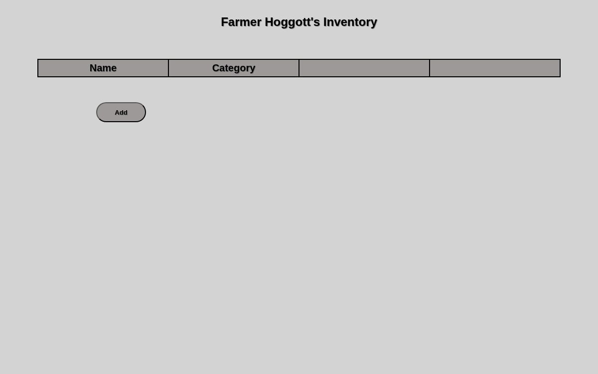
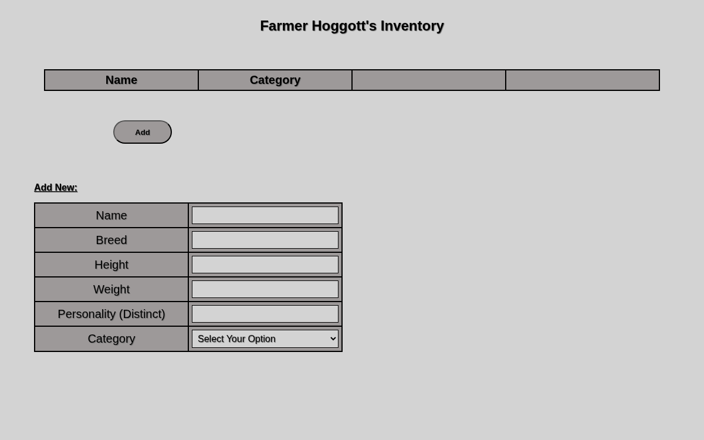
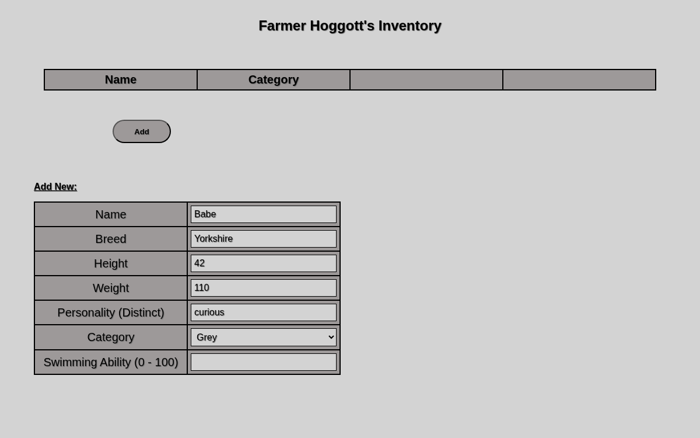
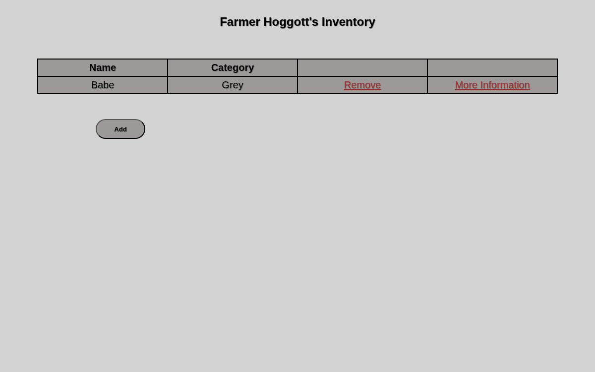
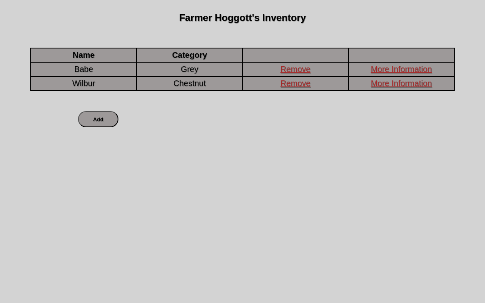
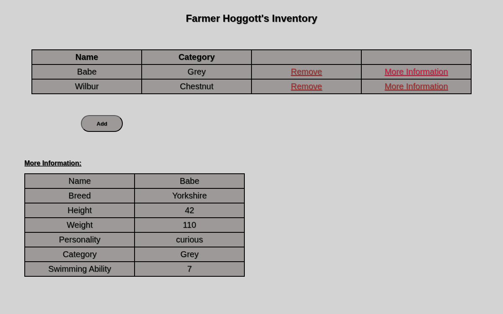
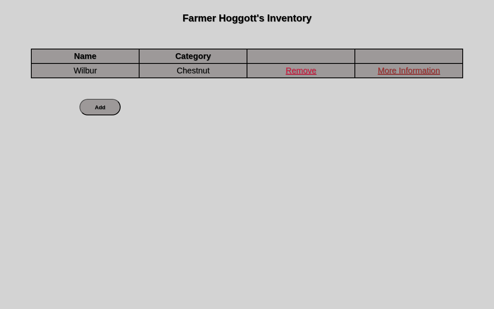
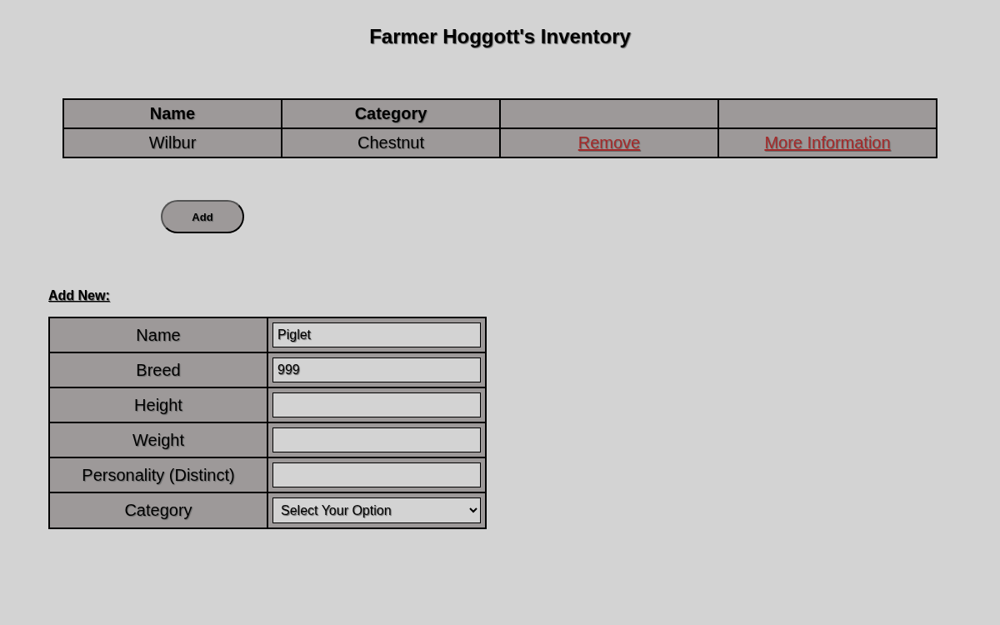

# Pig Inventory Web Application

A browser-based inventory management system for categorizing and tracking pigs by breed. Built with TypeScript and vanilla DOM APIs — no frameworks, no dependencies at runtime.

---

## Features

- **Category-based inventory** — manage four pig breeds: Grey, Chestnut, White, and Black, each with breed-specific attributes
- **Dynamic CRUD interface** — add, view, and delete pigs through a fully dynamic table and form that updates in real time based on the selected category
- **Multi-validator input system** — type checks, range guards, and uniqueness enforcement with inline alerts that block submission until all fields pass
- **Persistent state** — all inventory data is saved to `localStorage` via a dedicated `PigsController` class, so data survives page refreshes
- **Delete confirmation** — deletion dialogs prevent accidental data loss
- **No framework dependencies** — all DOM manipulation is done with native browser APIs; compiled TypeScript loads as native ES6 modules

---

## Tech Stack

| Layer | Technology |
|---|---|
| Language | TypeScript (compiled to ES6 modules) |
| Runtime | Vanilla JavaScript — no framework |
| Markup | HTML5 |
| Styling | CSS |
| Persistence | localStorage |
| Build Tool | TypeScript Compiler (`tsc`) |

---

## Class Hierarchy

```
Pigs (base class)
├── GreyPig
├── ChestnutPig
├── WhitePig
└── BlackPig
```

Each subclass extends the base `Pigs` class with breed-specific attributes and validation rules. A separate `PigsController` class manages application state, coordinates between the class instances and the DOM, and handles persistence to `localStorage`.

---

## Project Structure

```
Pig_Inventory_Web_Application/
  src/
    models/         # Pigs base class and subclasses
    controller/     # PigsController — state management and localStorage
    ui/             # DOM rendering and event handling
  tsconfig.json
  package.json
```

---

## Getting Started

### Prerequisites

- Node.js (for the TypeScript compiler)
- A modern browser (Chrome, Firefox, Safari, Edge)

### Installation

```bash
git clone https://github.com/arvinbm/Pig_Inventory_Web_Application.git
cd Pig_Inventory_Web_Application
npm install
```

### Build

```bash
npx tsc
```

This compiles all TypeScript source files into ES6 JavaScript modules in-place.

### Run

Open `src/index.html` directly in your browser, or serve the project with any static file server:

```bash
npx serve src
```

Then open `http://localhost:3000` in your browser.

---

## Usage

1. **Select a category** from the dropdown to filter the inventory table and load the appropriate input fields for that breed
2. **Fill in the form** — all fields are validated on submission; inline error messages appear for any failing fields
3. **Add a pig** — on successful validation the new entry appears in the table immediately and is saved to localStorage
4. **Delete an entry** — click the delete button on any row; a confirmation dialog appears before removal

---

## Screenshots

### Empty State

On first load the inventory table is empty and the form is hidden.



---

### Add Form

Clicking **Add** reveals the input form with fields for Name, Breed, Height, Weight, Personality, and Category.



---

### Form Filled — Category-Specific Field

After selecting a category, a breed-specific field appears dynamically. For **Grey** pigs this is *Swimming Ability (0–100)*; for Chestnut it's *Language*; White gets *Running Ability*; Black gets *Strength Ability*.



---

### Pig Added to Inventory

Once all fields pass validation, the pig is added to the main table automatically and persisted to `localStorage`.



---

### Multiple Pigs in Inventory

The inventory table supports any number of entries across all four categories.



---

### More Information Panel

Clicking **More Information** on any row expands a detail panel showing all breed-specific attributes for that pig.


---

### Delete — Remove Link

Each row has a **Remove** link. Clicking it triggers a confirmation dialog before the entry is deleted.



---

### After Deletion

After confirming the deletion, the entry is removed from the table and from `localStorage`.



---

### Input Validation — Invalid Breed

The breed field rejects numeric input. Entering a number triggers an alert and blocks the pig from being added until a valid word is provided.


---

### After Validation Alert

After dismissing the alert, the form remains open so the user can correct the invalid field and resubmit.



---

## Notes

- Data is stored in the browser's `localStorage` — clearing browser data will reset the inventory
- The TypeScript source compiles to ES6 modules loaded natively in the browser; no bundler is required
